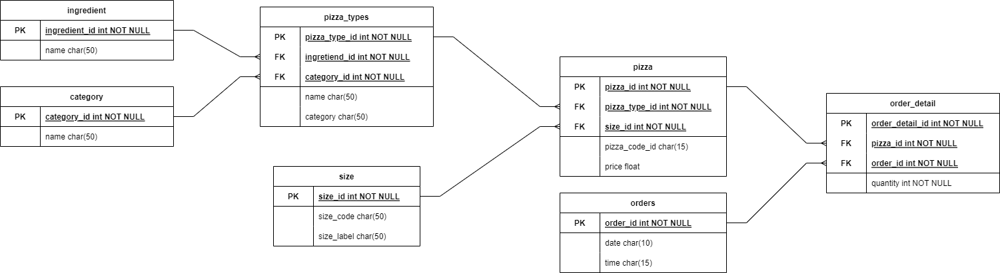

# ISDI Pizzería
## Antecedentes
Durante el año 2015, ISDI decidió abrir una pizzería para ayudar a sus estudiantes a pasar las tardes y noches 
de estudio de una forma más amena, ofreciendo pizzas con una buena materia prima y buen precio.

Tras todo lo acontecido en los últimos años, ISDI se plantea volver a abrirla, pero esta vez quiere mejorar varias cosas.
Se ha encontrado con una base de datos perdida que tiene información y con esta captura que informa un poco de cómo está
todo originado:



El equipo encargado de la explotación de este proyecto no tiene muy claro (todavía) qué uso se le puede dar a los datos
que hay en esta base de datos. Por ello, vamos a realizar unas búsquedas para ofrecer valor y sugerencias.

### Prospección básica
Vamos a realizar una búsqueda rápida en todas las tablas para saber qué información tenemos.

```sql
SELECT * FROM category;
SELECT * FROM ingredient;
SELECT * FROM pizza_type;
SELECT * FROM size;
SELECT * FROM pizza;
SELECT * FROM orders;
SELECT * FROM order_detail;
```

Necesitamos saber qué pizzas se han estado haciendo. Un listado de esas pizzas:

```sql
SELECT DISTINCT(name), pizza_type_code FROM pizza_type;
```

¿Y cuántas son?

```sql
SELECT COUNT(DISTINCT(name)) FROM pizza_type;
```

¿Cuántos ingredientes utiliza cada pizza?

```sql
SELECT COUNT(ingredient_id), name  FROM pizza_type group by name;
```

Y ordenadas de mayor a menor

```sql
SELECT COUNT(ingredient_id), name  FROM pizza_type group by name order by COUNT(ingredient_id) DESC;
```

¿Cuál es el ingrediente más usado en las pizzas?

```sql
select count(*), i.name FROM pizza_type pt LEFT JOIN ingredient i ON i.ingredient_id = pt.ingredient_id GROUP BY i.name ORDER BY COUNT(*) desc;
```

Las pizzas están agrupadas por Categoría. ¿Cuál es el ingrediente más utilizado en cada categoría?

```sql
SELECT c.name AS category_name, 
    i.name AS ingredient_name, 
  	COUNT(pt.ingredient_id) AS usage_count 
FROM pizza_type pt 
JOIN ingredient i on i.ingredient_id = pt.ingredient_id 
JOIN category c on c.category_id = pt.category_id 
GROUP BY i.name, c.name
ORDER BY 
    usage_count DESC, 
  	c.name, 
  	i.name;
```
Avanzado
```sql
SELECT category_name, ingredient_name, usage_count FROM (
  SELECT *, ROW_NUMBER() OVER (PARTITION BY category_name ORDER BY usage_count DESC) as rn FROM (
  	SELECT c.name AS category_name, 
  		i.name AS ingredient_name, 
  		COUNT(pt.ingredient_id) AS usage_count 
  	FROM pizza_type pt 
  	JOIN ingredient i on i.ingredient_id = pt.ingredient_id 
  	JOIN category c on c.category_id = pt.category_id 
  	GROUP BY i.name, c.name
	)
  ) WHERE rn = 1;
```

### Prospección intermedia

¿Qué día se ha tenido mayor número de pedidos?

```sql
SELECT count(*), date
FROM orders GROUP BY date 
ORDER BY COUNT(*) DESC;
```

¿Cuál es la pizza más vendida?
```sql
SELECT COUNT(*), p.pizza_code_id 
FROM order_detail od 
JOIN pizza p ON p.pizza_id = od.pizza_id 
GROUP BY p.pizza_code_id 
ORDER BY COUNT(*) DESC;
```

¿En qué rango de horas suele haber mayor número de pedidos?
```sql
SELECT count(*), SUBSTR(time,0,3) from orders GROUP BY SUBSTR(time,0,3) ORDER BY COUNT(*) DESC;
```

¿Cuál es el valor medio de los pedido?
```sql
SELECT AVG(quantity * price) FROM order_detail od JOIN pizza p ON od.pizza_id = p.pizza_id
```

¿Cuál es el pedido con mayor valor, qué día y hora se realizaron?
```sql
SELECT MAX(price), order_id, date, time FROM (
    SELECT SUM(p.price) as price, o.order_id, o.date, o.time
    FROM orders o
    JOIN order_detail od ON o.order_id = od.order_id
    JOIN pizza p on od.pizza_id = p.pizza_id
    GROUP BY o.order_id
);
```

¿Cuáles son las pizzas vendidas cada mes?
```sql
SELECT * 
FROM (
  SELECT row_number() OVER (PARTITION BY month ORDER BY total desc) as rn,
    total, 
    month, 
    name 
  FROM (
    SELECT SUM(quantity) AS TOTAL, month, name 
    FROM(
      select SUBSTR(o.date,6,2) as month,
        pt.name,
        quantity
      from order_detail od
	  JOIN orders o ON od.order_id = o.order_id
	  JOIN pizza p ON od.pizza_id = p.pizza_id
	  join pizza_type pt ON pt.pizza_type_id = p.pizza_type_id)
	  GROUP BY month, name
    )
)
WHERE rn = 1;
```

### Prospección Avanzada

¿Cuál ha sido el total por cada ingrediente utilizado (Utilizad el valor de un uso de ingrediente para S, 2 para M, 3 para L, etc.)
De esta forma, sabremos el volumen de ingredientes que pueden ser necesarios en la pizzería.

```sql
SELECT SUM(quantity_unities), name FROM (select 
	CASE
    	WHEN s.size_code='S' THEN 1 * quantity 
        WHEN s.size_code='M' then 2 * quantity 
        WHEN s.size_code='L' THEN 3 * quantity 
        WHEN s.size_code='XL' THEN 4 * quantity 
        ELSE 5 * quantity 
    END AS quantity_unities,
    i.name
from order_detail od
JOIN pizza p ON od.pizza_id = p.pizza_id
JOIN size s ON s.size_id = p.size_id
JOIN pizza_type pt on pt.pizza_type_id = p.pizza_type_id
JOIN ingredient i ON pt.ingredient_id = i.ingredient_id)
GROUP BY name;
```

Con esta información, podemos optimizar las pizzas que se utilizan, para ello, hay ciertos ingredientes que no se utilizan.
¿Qué ingredientes y de qué pizzas son?

```sql
SELECT DISTINCT pt2.name, i2.name FROM (select 
	DISTINCT i.name AS current_name
    FROM order_detail od
    JOIN pizza p ON od.pizza_id = p.pizza_id
    JOIN size s ON s.size_id = p.size_id
    JOIN pizza_type pt on pt.pizza_type_id = p.pizza_type_id
    JOIN ingredient i ON pt.ingredient_id = i.ingredient_id)
RIGHT JOIN ingredient i2 ON current_name = i2.name
RIGHT JOIN pizza_type pt2 ON pt2.ingredient_id = i2.ingredient_id
WHERE current_name is null;
```
